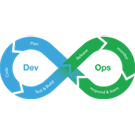

[[imgBadge]]
| 

[[imgBadge]]
| 

[[imgBadge]]
| 

[[imgBadge]]
| 

[[imgBadge]]
| 

[[imgBadge]]
| 

[[imgBadge]]
| 

[[imgBadge]]
| 

[[imgBadge]]
| 

[[imgBadge]]
| 

Sam Wagner is a Software Engineer who loves building software that makes life better for the people using it.

He is especially passionate about front-end development, UI, and UX, with a strong focus on creating software that is clear, polished, and genuinely pleasant to use. He cares about the details because good user experiences are rarely accidental.

Sam enjoys solving problems that matter. He likes to dig deep and understand what is really going on, whether that means looking at the code, the surrounding systems, or the people involved. He believes the best solutions come from seeing the full picture, not just the technical one.

Although Sam loves code, he does not think code is the answer to every problem. In his experience, many of the hardest challenges are really people challenges: communication gaps, unclear processes, competing priorities, or misaligned expectations. Good software helps, but good thinking comes first.

His approach is simple: move fast, learn fast, and improve fast. Sam believes progress comes from trying things, making mistakes early, and using that learning to move toward a better outcome, while keeping delivery safe and responsible.

Clients value Sam for his thoughtful approach, strong eye for user experience, and genuine desire to leave a business in a better place than he found it.
