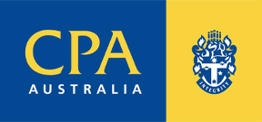

[[imgBadge]]
| 

As a Senior Accountant at SSW with over seven years of experience, I thrive at the intersection of financial expertise and technology, tackling complex challenges with innovative solutions. Collaborating closely with our Financial Controller, I ensure the seamless operation of our financial systems through accurate reporting, efficient process management, and strategic planning. 

My career has been defined by driving efficiency and delivering results. By implementing advanced automation tools like Xero, I have streamlined workflows, improved reporting accuracy, and empowered data-driven decision-making. My approach to management accounting focuses on actionable insights that support growth and long-term success. 

Finance is more than my profession—it’s a field where I channel my passion for solving problems and creating meaningful value. I am eager to connect with those seeking expertise in financial management, operational efficiency, or technology-driven innovation. 

Outside of work, I enjoy immersing myself in strategy board games and discovering the magic of literature, always eager for new stories and adventures. 
