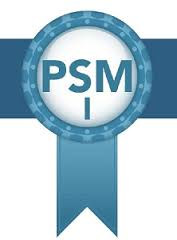

 
  

Stephen Carter is a Senior Software Architect and the Victorian State Manager with SSW. He is a certified Professional Scrum Master with a background in business, transport, education, NFP/NGO and emergency services.   

Stephen has broad experience in IT and business through a career spanning 30 years managing the end-to-end delivery of technology projects, with a strong track record of partnering with businesses to deliver technology-enabled transformation in diverse industries including government, rail, digital agency, insurance, emergency services, utilities and private business.  

Some of Stephen's recent career highlights:   

*   Presenting HoloLens to the Canberra and Sydney .NET User Groups, DDD Brisbane and showing developers how they can get started with HoloLens development
*   Leading a team of up to 30 members delivering infrastructure, in-house developed software and vendor supplied software projects, establishing standardized reporting across the ICT project portfolio  

*   Leading delivery of a rail infrastructure fault management system  

*   Leading delivery of a rail works planning system
*   Leading delivery of a rail safety observations system
*   Leading delivery of an asset geospatial data service  

*   Senior Software Engineer migrating 80+ applications into a single network
*   Senior Software Engineer developing CMS applications in a digital agency environmentStephen cut his teeth developing systems in Microsoft Access and Visual Basic for Applications (VBA) in the 1990's for Police, Education, Transport and Utilities. In 2012 he migrated numerous Access applications during a network consolidation project for a major Victorian public transport franchisee. In 2016 he migrated data from an Access database to SQL Server, keeping Access as the frontend and modifying the VBA codebase to work with the new SQL backend.  

Stephen believes we are on the crest of another technological revolution with the release of Microsoft’s HoloLens, and he is champing at the bit to explore the world of mixed reality and to share his learnings with developers, business, and enthusiasts alike. He is working on developing a proof of concept application for HoloLens using object recognition with potential applications in asset management and maintenance.  

   In his spare time, Stephen enjoys martial arts, mountain biking, playing bass guitar, photography, cooking and travelling.   