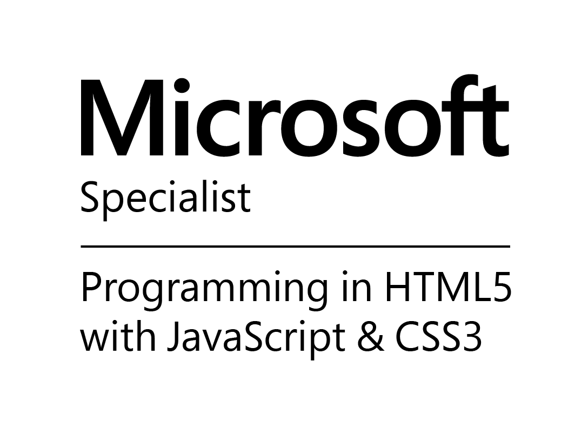

 
    

  
 
  
  
 

Let's start with his personal profile. He's Brazilian which by itself already makes him awesome. He loves dancing, and he's good at it but hasn't been doing it lately as he barely has any free time apart from watching his kids play and laugh.  

Thiago joined SSW in 2014 as a Senior Software Architect. He's specialized in SharePoint and .NET Core, and loves all aspects of C#, working on windows and web applications, including distributed applications and web services.  

Thiago has over 10 years of experience in the IT industry in a wide range of technologies which would take several pages to list everything, but it's worth listing some key points:  

*   **Azure:** loves doing Serverless with Functions, containers with Kubernetes and all things Azure****  

*   **Angular:** The current favorite  

*   **ASP.NET MVC**: Microsoft Certified Professional  

*   **SharePoint: **he's been working with it since 2009. He's a Microsoft Certified Solutions Developer in SharePoint 2013, Microsoft Certified Professional Developer in SharePoint 2010 and enthusiast in SharePoint 2016  

*   **SQL**: he's been working with it for as long as he can remember  

*   **HTML, JS, CSS, KendoUI**: Thiago is not a designer, but this doesn't stop him from knowing a lot about HTML, CSS and client script, which makes him a great asset to implement a design    

Before joining SSW, Thiago worked for a consultancy company in Melbourne. There he specialized in SharePoint development and infrastructure. Over the last 5 years, Thiago has focused on assisting clients with:

*   SharePoint solution architecture
*   Automating SharePoint deployment and configuration
*   Performing reviews of client built SharePoint solutions and providing findings and recommendations (both Infrastructure and code)