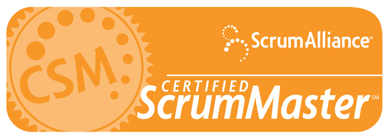

 
  
Ulysses is the General Manager of SSW and has been managing the team since 2006.   

Used to working under pressure, he is Adam Cogan's 2nd in charge, and keeps the company running smoothly while also dealing with SSW's clients and the development and design teams. His passion is making sure that all the guys at SSW feel like a family, while always improving their skill sets and challenging them to constantly expand their horizons.  

Ulysses is the Scrum Master for internal development teams, the design, video, and marketing teams, as well as client projects. Integrity, transparency, and a smooth running team are all very important to him. He's also a [Power BI](http://adamcogan.com/2016/10/13/power-bi-no-more-guessing/) guru.   

In his spare time, he is one of Australia's top Salsa teachers and is the 5 times Australian Salsa Champion, 5 times Australian Bachata Champion, and part of the Bachata World Champion team, Modus Vivendi. You can see more about this part of his life on his [Salsa Blog](http://salsaulysses.wordpress.com/).