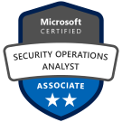

[[imgBadge]]
| 
[[imgBadge]]
| 
[[imgBadge]]
| 
[[imgBadge]]
| 

---

Warwick is a seasoned Systems Administrator with over 20 years of experience. His strong background spans network management, Windows Server Administration, and cloud solutions, making him adept at bridging the gap between technology and user needs. As a Certified Scrum Master, he leverages agile methodologies to drive innovation and efficiency.

**Industries**: Education, Technology Services, Business Solutions

**Technologies**:
- Microsoft Azure (Azure Active Directory, Azure Virtual Network, Azure SQL)
- Office 365
- Microsoft Endpoint Configuration Manager
- Microsoft Intune
- PowerShell
- GitHub Actions
- Bicep
- Azure DevOps
- SharePoint
- Power Automate
- Power Apps
- Power BI
- Zendesk

**Key Skills and Achievements**:
- **Network Management & Windows Server Administration**: Expert in routing, switching, and managing Windows Server environments to ensure optimal performance and security.
- **Cloud Infrastructure**: Proficient in deploying and managing scalable, resilient cloud solutions using the Azure ecosystem.
- **DevOps & Automation**: Skilled in automating workflows and streamlining development lifecycles using PowerShell, GitHub Actions, Bicep, and Azure DevOps.
- **Low-Code Development**: Experienced in creating collaborative workspaces and rapid applications with SharePoint, Power Automate, and Power Apps.
- **Training & User Support**: Provides comprehensive training on Microsoft operating systems and servers; adept with Zendesk for enhanced customer support.
- **Data Analytics**: Utilizes Power BI to enable data-driven decision-making within organizations.
- **IT Security**: Implements robust security practices to safeguard systems against internal and external threats.

**Professional Development**:
- **Certified Scrum Master**
- **Azure Security Engineer (AZ 500)**
- Committed to continuous learning and staying abreast of emerging technologies and best practices.

Warwick's dedication to excellence enhances productivity, security, and overall system performance. His holistic approach to IT solutions drives business growth and fosters innovation.

