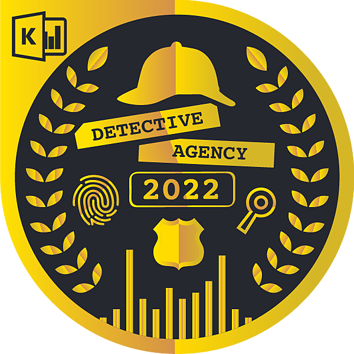

[[imgBadge]]
| 
[[imgBadge]]
| 

---
Warwick is a seasoned Systems Administrator and IT Solutions Architect with over two decades of experience. He possesses a strong background in both network management, focusing on routing and switching, and Windows Server Administration. His competence extends to Microsoft's suite of productivity tools, including Office 365, Microsoft Endpoint Configuration Manager, and Microsoft Intune, ensuring seamless communication and efficient system management across diverse IT environments.

Diving deeper into cloud solutions, Warwick's depth of expertise encompasses the Azure ecosystem. He's adept at leveraging Azure Active Directory for identity and access management, Azure Virtual Network for advanced networking capabilities, and Azure SQL for robust database solutions, ensuring scalable and resilient cloud infrastructures.

In the realm of DevOps and automation, Warwick stands out with his proficiency in tools like PowerShell, GitHub Actions, and Bicep. He embraces a holistic approach to IT by integrating solutions with Azure DevOps practices. This ensures efficient software compatibility, effortless system upgrades or installations, and a streamlined development lifecycle that responds quickly to changing business needs.

On the low-code front, Warwick is adept with Microsoft's suite of productivity tools, particularly SharePoint for collaborative workspaces, Power Automate for workflow automation, and Power Apps for rapid application development. His commitment to user experience is evident as he not only focuses on backend operations but also imparts training on Microsoft operating systems, servers, and specialized education software. His experience with customer support tools like Zendesk further showcases his dedication to ensuring a smooth user experience. Additionally, his passion for data-driven decisions shines through his skills in Power BI for analytics, enabling organizations to harness the power of their data.

In the rapidly evolving field of IT security, Warwick stands out with his robust knowledge of security best practices. He's committed to ensuring that systems are not just optimized but also safeguarded against potential threats, implementing layers of protection to defend against both internal and external vulnerabilities.

With his comprehensive IT skill set, Warwick is equipped to bridge the gap between technology and user needs, offering solutions that enhance productivity, security, and overall system performance, driving business growth and innovation.

