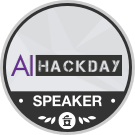
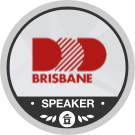

[[imgBadge]]
| 

[[imgBadge]]
| 

[[imgBadge]]
| 

[[imgBadge]]
| 

[[imgBadge]]
| 

[[imgBadge]]
| 

[[imgBadge]]
| 

[[imgBadge]]
| 

[[imgBadge]]
| 

[[imgBadge]]
| 

[[imgBadge]]
| 

[[imgBadge]]
| 

[[imgBadge]]
| 

[[imgBadge]]
| 

---

William is a **Solution Architect** with over 18 years of professional experience spanning multiple industries such as Heavy Engineering, Mining, 3D Graphics, Education and Finance.

With his many years of experience, William has learnt how to adapt to new industries, and this gives him a unique talent for synchronizing with his clients' business languages and processes to successfully build their solutions.

## Application Modernization and Cloud Adoption

He is one of the core engineers at SSW and specializes in developing [Enterprise Cloud Applications](https://www.ssw.com.au/ssw/Consulting/Web-Applications.aspx) hosted on [Azure](https://www.ssw.com.au/ssw/Consulting/Azure.aspx).

William is a specialist in [Application Modernization](https://www.ssw.com.au/ssw/Consulting/Strategic-Architecture.aspx) and helped some of Australia's largest software companies and financial institutions through digital transformation processes to successfully [migrate to Azure](https://www.ssw.com.au/ssw/Consulting/Azure.aspx) and take full advantage of the Cloud.

## DevOps Technologies

William has a passion for automating DevOps processes with GitHub and Azure DevOps. Definitely not a fan of ClickOps!

He also has experience in using other tools such as VSTS/TFS, BitBucket, TeamCity, Jenkins, Bamboo and Octopus Deploy.

## Development Technologies

His technology toolbelt includes:

* Azure DevOps
* GitHub
* Octopus Deploy
* ASP.NET Core
* Blazor
* Docker
* [Kubernetes](https://www.ssw.com.au/ssw/Consulting/Kubernetes.aspx)
* Serverless Computing
  * Azure Functions
  * Azure Container Instances (ACI)
  * Azure Container Apps (ACA)
* Distributed Systems / Microservices
* [Clean Architecture](https://rules.ssw.com.au/rules-to-better-clean-architecture)
* Event Driven Architecture
* Azure Cosmos DB
* Azure SQL
* Azure Networking
* and more...

Development and DevOps aren't his only strong points. He is a highly motivated [Scrum](https://www.ssw.com.au/ssw/Consulting/Scrum.aspx) practitioner, strong team player and thinks outside of the box! William has had great success in both starting new Scrum teams, and also upskilling and mentoring existing development teams.

## Internal Projects

### [SSW Sophie Bot](https://sswsophie.com/sophiebot)

William lead a team to build a smart office bot that integrates with Microsoft Teams, Skype and Google Assistant.

One major use case for **SophieBot** is to help our SSW State Managers and Clients to find the right developer for any project simply by talking to a Bot using natural human language. SophieBot can determine which developers from any of our offices have the right skills for a project and if they are available to be booked for this project. All the information required to answer this simple query can be spread across multiple systems such as Dynamics CRM, TimePro, LinkedIn, SalesForce, Delve, and more. SophieBot has integrations that can collect all the relevant information and fulfill the seemingly simple query and save the SSW State Managers a lot of time and effort.

Relevant technologies: Azure Functions, Azure Bots, Google DialogFlow Firebase, Azure Table Storage, Azure Cosmos DB, Docker, NodeJS, Dynamics 365.

## Training

William is a trainer on the [SSW Azure Superpowers Tour](https://www.ssw.com.au/ssw/Events/Training/Azure-Superpowers-Tour.aspx) at major cities around Australia and Online, and has received top evaluation scores!

[[imgLg]]
| 

## Public Speaking

William has spoken at conferences such as:

* [NDC Sydney](https://ndcsydney.com/speakers/william-liebenberg/)
* [NDC Melbourne](https://ndcmelbourne.com/speakers/william-liebenberg/)
* [DDD Brisbane](https://dddbrisbane.com/agenda/2019)
* [Global AI on Tour - Melbourne](https://globalai.community/global-ai-on-tour/australia-melbourne-1)

## Community Events

Being an active member of the local development community is very important to William. He attends as many meetups and workshops as he can.

William is President of the [Melbourne .NET User Group](https://www.meetup.com/Melbourne-NET-User-Group/) hosted at [SSW Melbourne](https://www.ssw.com.au/ssw/NETUG/Melbourne.aspx) and co-organizer of the [Melb.NET Meetup](https://www.meetup.com/melb-net-meetup/) group.

In 2020 William launched the [AI Hack Day](https://aihackday.com) free community event. As an event Host, Mentor and Presenter he helps attendees to build applications that utilize Azure Cognitive Services and Machine Learning.

He has also presented and mentored at the following Hack Day events:

* [AI Hack Day - Melbourne 2020](https://aihackday.com)
* [Xamarin Hack Day - Melbourne 2019](https://xamarinhackday.com)
* [Angular Hack Day - Melbourne 2019](https://angularhackday.com/)
