[[imgBadge]]
| 

[[imgBadge]]
| 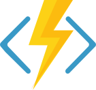

[[imgBadge]]
| 

[[imgBadge]]
| 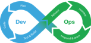

[[imgBadge]]
| 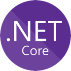

[[imgBadge]]
| 

[[imgBadge]]
| 

[[imgBadge]]
| 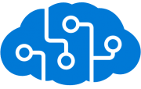

[[imgBadge]]
| 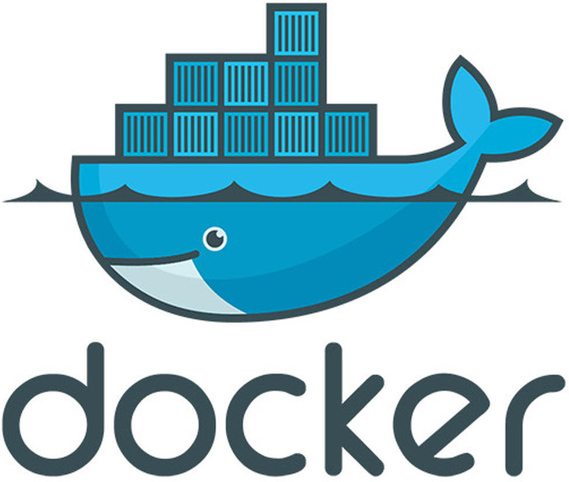

---

William is a **Solution Architect** with over 16 years of professional experience spanning multiple industries such as Heavy Engineering, Mining, 3D Graphics, Education and Finance.

With his many years of experience William has learnt how to adapt to new industries and this gives him a unique talent for syncronizing with his clients' new business languages and processes to build their solutions.

## Application Modernization

Specializing in [Application Modernization](https://www.ssw.com.au/ssw/Consulting/Strategic-Architecture.aspx) he helped some of Australia's largest software companies and financial institutions through the digital transformation processes and sucessfully [migrate to Azure](https://www.ssw.com.au/ssw/Consulting/Azure.aspx) and take full advantage of the Cloud.

## Development Technologies

He is one of the core engineers at SSW and specializes in developing Enterprise Cloud Applications with [Azure](https://www.ssw.com.au/ssw/Consulting/Azure.aspx).

William has a passion for developing enterprise-grade [Web Applications](https://www.ssw.com.au/ssw/Consulting/Web-Applications.aspx), and automating Build, Release and Testing with Azure DevOps Pipelines. William also has experience in using VSTS/TFS, TeamCity, Jenkins, and Bamboo.

His technology toolbelt includes:

* Angular
* Azure DevOps
* ASP.NET Core
* Blazor
* Serverless Functions
* [Clean Architecture](https://rules.ssw.com.au/rules-to-better-clean-architecture)
* Cognitive Services
* Cosmos DB
* Docker
* [Kubernetes](https://www.ssw.com.au/ssw/Consulting/Kubernetes.aspx)
* React
* and more...

Development and DevOps aren't his only strong points. He is a highly motivated [Scrum](https://www.ssw.com.au/ssw/Consulting/Scrum.aspx) practitioner, strong team player and thinks outside of the box! William has had great success in both starting new Scrum teams, and also upskilling and mentoring existing development teams.

## Internal Projects

### [SSW Sophie Bot](https://sswsophie.com/sophiebot)

William lead a team to build a smart office bot that integrates with Microsoft Teams, Skype and Google Assistant.

One major use case for **SophieBot** is to help our SSW State Managers and Clients to find the right Developer for any project simply by talking to a Bot with natural human language. SophieBot can determine which developers in any of our offices have the right skills for a project and even if they are available to be booked for this project. All the information required to answer this simple query can be spread across multiple systems such as Dynamics CRM, TimePro, LinkedIn, SalesForce, Delve, and more. SophieBot has integrations that can collect all the relevant information and fulfill the seemingly simple query:

> "Who has Angular skills available next week for 4 days?"

`youtube: dgXCgljyGGo`

Relevant technologies: Azure Functions, Azure Bots, Google DialogFlow Firebase,Azure Table Storage, Azure Cosmos DB, Docker, NodeJS, Dynamics 365.

## Training

William is a trainer on the [SSW TV Azure Superpowers Tour](https://www.ssw.com.au/ssw/Events/Training/Azure-Superpowers-Tour.aspx) at major cities around Australia and Online, and has received top evaluation scores!

[[imgMd]]
| 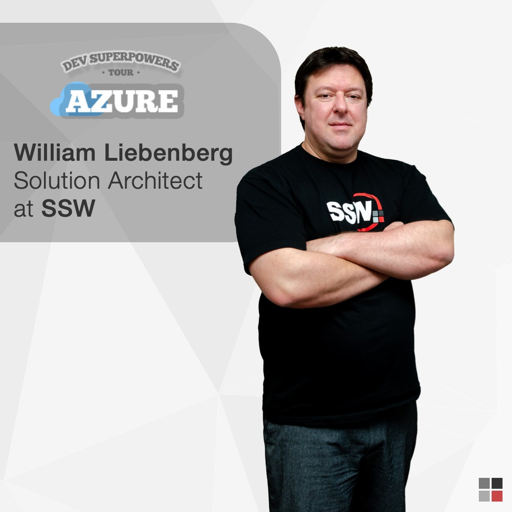

## Public Speaking

William has spoken at conferences such as [NDC Sydney](https://ndcsydney.com/speaker/william-liebenberg/) and [DDD Brisbane](https://dddbrisbane.com/agenda/2019).

[[imgMd]]
| 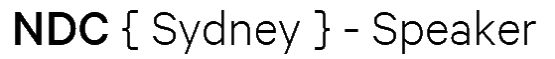

[[imgMd]]
| 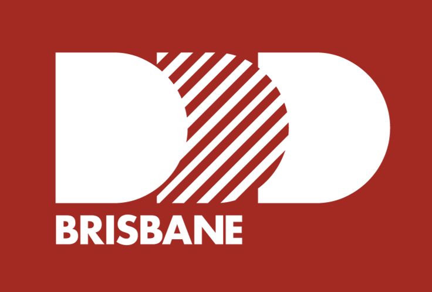

`youtube: zxSlKiWOOzw`
Figure: Azure SpendOps – The Art of Effectively Managing Azure Costs - William Liebenberg

[[imgMd]]
| 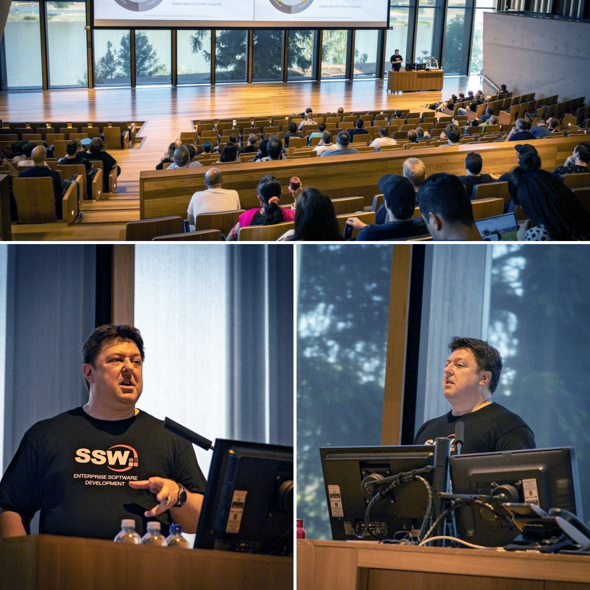

## Community Events

Being an active member of the local development community is very important to William. He attends as many meetups and workshops as he can.

He is President of the [Melbourne .NET User Group](https://www.meetup.com/Melbourne-NET-User-Group/) hosted at [SSW Melbourne](https://www.ssw.com.au/ssw/NETUG/Melbourne.aspx).

[[imgSm]]
| 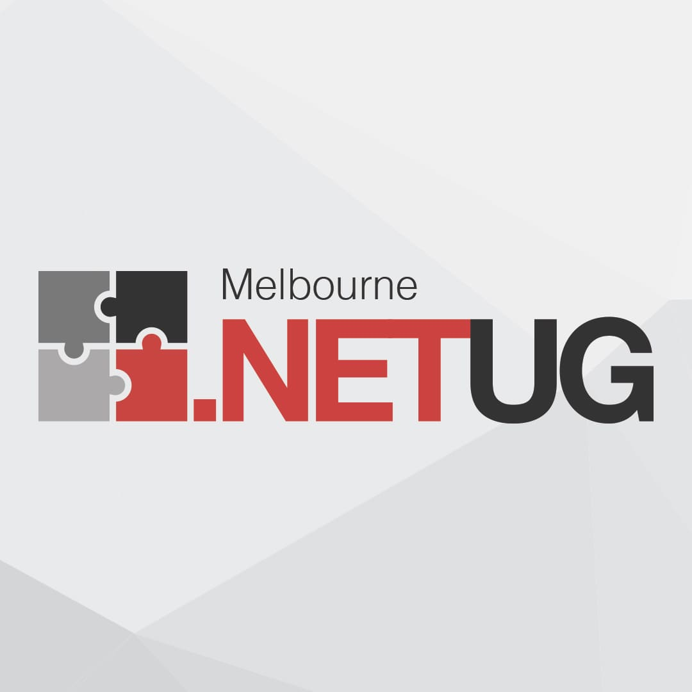

In 2020 William helped launching the new [AI Hack Day](https://aihackday.com) free community event. He also took on the role of Mentor and Presenter to help get the attendees started with building Bots.

[[imgMd]]
| 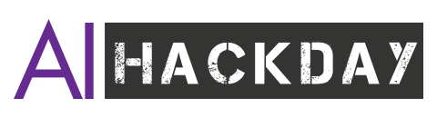

William has also presented and mentored at the following Hack Day events:

* [Xamarin Hack Day - Melbourne 2019](https://xamarinhackday.com)

[[imgMd]]
| 

* [Angular Hack Day - Melbourne 2019](https://angularhackday.com/)

[[imgMd]]
| 
