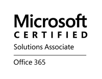
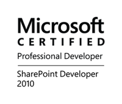
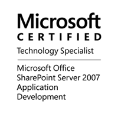

  
 

William is a software developer at SSW. He specializes in developing solutions with SharePoint (with client side javascript extensions – mostly with JQuery, Angular and React) , ASP.NET, SQL server and Azure.

**Background:**

- William started off on the IT pro side before switching to become a developer. Back in the day he first became a Microsoft Certified System Engineer in early 2002. He worked on extending Microsoft Exchange and Lync and other collaboration systems for different Enterprises based on Microsoft's Active Directory infrastructure.

- William first met SharePoint in 2006, since then, he has been working with SharePoint for over a decade.

**William's selected client projects: **

- **[Allianz](https://www.allianz.com/)** - PAGE (Partnered Allianz Global Education) is an online solution for Allianz marketing and selling of ancillary products and services to students studying abroad (to make students' overseas lives easier), integrated with the existing IH (International Health) system.  
  Related Technology: ASP.NET Core, Angular 4, Bootstrap 4, PrimeNG and SQL server.

- [Coffey](http://www.coffey.com/) - Integrated "project management system CPN" and "SharePoint sites" with trusted domain from "tetratech", automate permission setting for switched domain users. Also provided technical support for data conversion.  
  Related Technology: SharePoint (2007, 2010 and SharePoint online in Office 365), ASP.NET C# and SQL.

- [Aftercare](http://www.aftercare.com.au/) - Upgraded SharePoint intranet from 2010 to 2013 and enhanced it with My Site portal configuration, search enhancement, SSL setting up, Office Web App and Active Directory integration. Users gained centralized locations for documents storage, collaboration, enterprise search as well as in-browser documents editing experience.  
  Related Technology: SharePoint, Office Web App, Active Directory.

- [Bupa](https://www.bupa.com.au/) - Developed a "claim case management" web system which is used to replace Excel client to manage "insurance claim cases". The system provides modern responsive UI, better claim case status control and search experience.  
  Related Technology: ASP.NET, MVC,  C#, CSS, JQuery, Web API and Telerik controls.

- [Rydges Hotel flexible booking system](https://bookings.rydges.com/rates#Flexible) - Developed a complex backend and simple to use frontend that included a fast calendar date picker and brought much flexibility for users to book their favourite room type.  
  Related Technology: ASP.NET, MVC,  C#, CSS, JQuery and Web Services.

- [Carnival Australia](http://www.pocruises.com.au/) - Developed a public company portal which integrated with a backend cruise booking system. Upgraded SharePoint sites from 2007 to 2013 including both content and customized features. Developed an extranet for their agents and also developed an internal KB system, all powered by SharePoint.  
  Related Technology: SharePoint, ASP.NET,  C#, CSS, JQuery, AngularJS, SQL Reporting Services and Web Services.

- [WorleyParsons](http://www.worleyparsons.com/) - An internal SharePoint collaboration and knowledge management system used by a global user base.  
  Related Technology: SharePoint, ASP.NET, C#.

**William's internal project mainly focuses on: **

- [Rules.SSW](/) - Developed a state of the art new SSW website to take 12,000 ASP.NET pages into a SharePoint public site. This site took advantage of SharePoint’s document management, version control and publishing workflow. This new site gave SSW editors a substantially better experience and their website visitors a better user experience.  
  Related Technology: SharePoint, ASP.NET, C#, XML, JQuery, Web Services, TFS and SQL Server.
- <strong style="line-height:1.5em;"> SharePoint intranet\*\* - This SharePoint site is used by all SSW employees to store shared resources and provide project management, internal administrative and global search functionality.  
  Related Technology: SharePoint, ASP.NET, C#, Web Services and SQL Server.  
  </strong>

**Favourite quote:**

William feels he is constantly improving so his favourite quote is _"There is no best, only better". _
