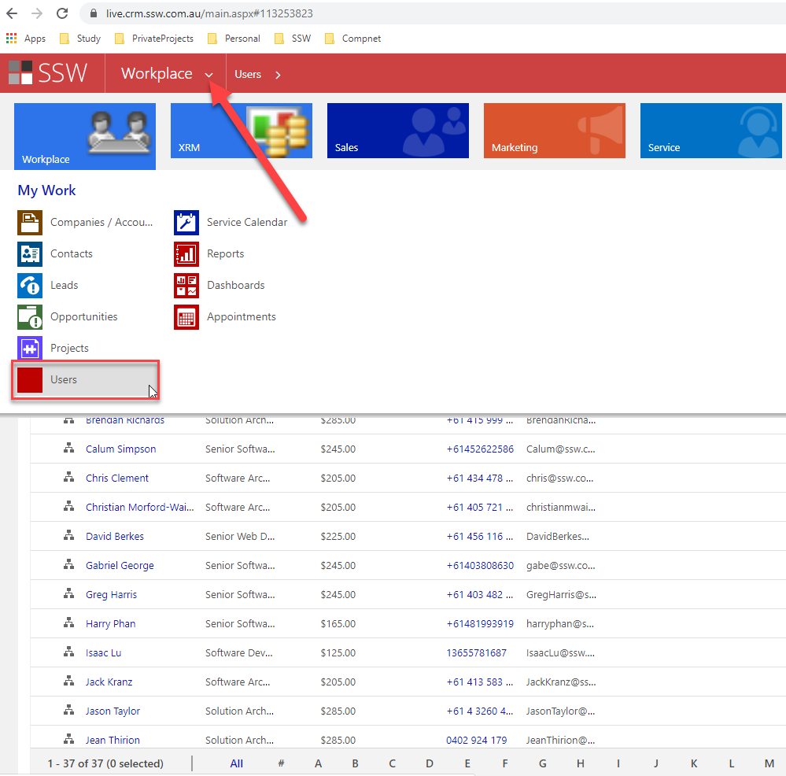
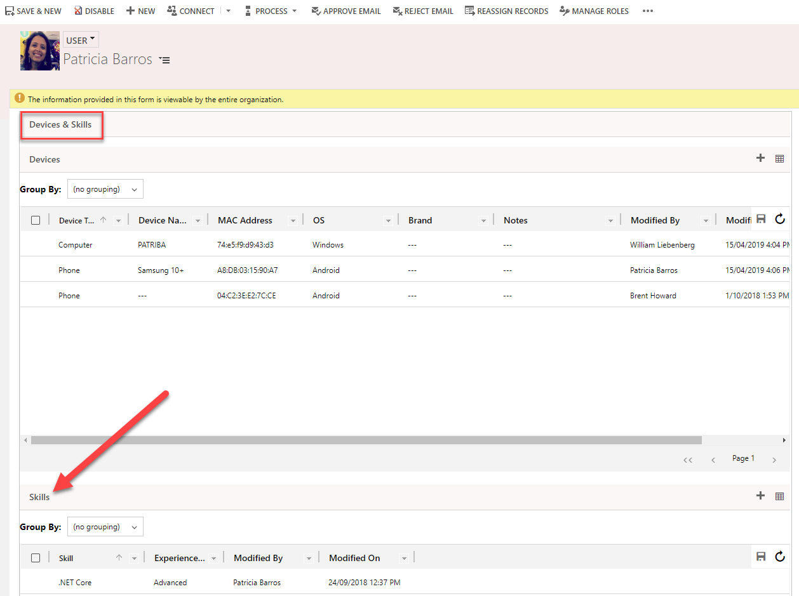
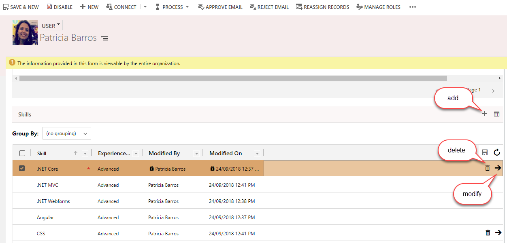
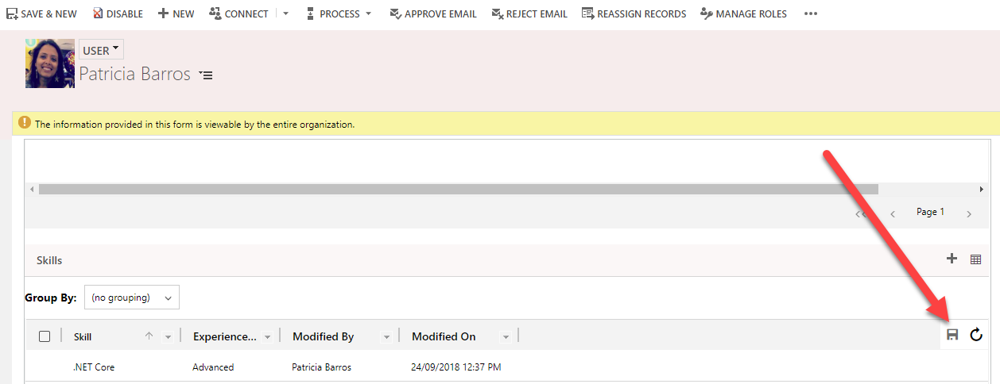

## How to add CRM Skills

1. Navigate to CRM - https://live.crm.ssw.com.au/main.aspx#

2. Search and open your user
  
**Figure: Find your user profile in CRM**

3. Scroll the page until Devices & Skills section

  
**Figure: Scroll the page until Devices & Skills section**

4. Add, Modify or Delete a Skill

  
**Figure: Change your list of skills**

5. Save your changes

  
**Figure: Save your changes**

> Important: SSW.People website is updated ever hour. This means that you will need to wait 1 hour until your skills changes reflect in your profile page.
